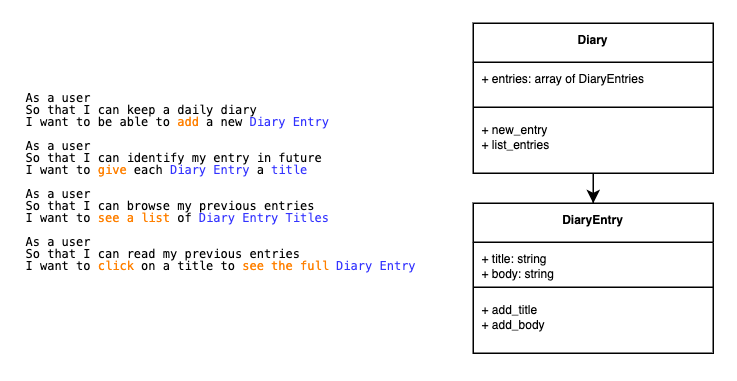
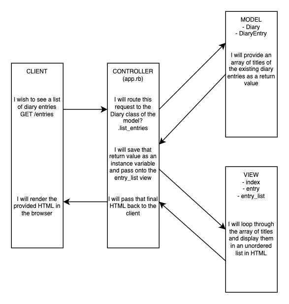

# Daily Diary App

[](https://app.travis-ci.com/PKilgarriff/daily-diary-app)

## Description

Diary webapp written in ruby, used to store and refer to diary entries entered by a user.

## Setting Up

```zsh
git clone https://github.com/PKilgarriff/daily-diary-app
cd daily-diary-app
bundle install
```

### Database Setup

1. Connect to `psql`<br>
2. Run the following SQL commands to create test and production databases:

```
CREATE DATABASE daily_diary;
CREATE DATABASE daily_diary_test;
```
Setup the production database tables with the following SQL command:<br>
_NB: The testing database tables will be setup by the testing files automatically, there is no need for you to repeat this step for daily_diary_test_

```
CREATE TABLE entries (id SERIAL PRIMARY KEY, title VARCHAR(60), body VARCHAR(300), time timestamp);
```

## Running the Daily Diary App

Once you have followed the steps in [Setting Up](/README.md#setting-up) run the following commands:

1. ```rackup```
2. Connect to [localhost:9292](http://www.localhost:9292)
3. Follow the instructions within the interface

## Testing the Daily Diary App

Once you have followed the steps in [Setting Up](/README.md#setting-up) run the following commands.

1. ```rspec```
2. Browse the output in your terminal

-------

# My Approach to the Challenge

- Set up a repository with technologies that have proven useful for Testing and Development so far:
  - Sinatra
  - Capybara
  - RSpec
  - Postgres gem
  - SimpleCov
  - Rubocop
- Configure Travis CI
  - needed to explicitly add the linux environment to the Gemfile.lock with `bundle lock --add-platform x86_64-linux`
- Begin writing Skeleton Readme
- Write feature test for Homepage
  - pass with minimal implementation
    - expected string hard-coded in controller
- Set up config.ru and spec_helper to run DiaryApp
- Refactor to use index.erb view instead of hard-coded string in controller
- Returned to User Stories now that basic setup is complete, beginning with [Must Haves](/user_stories.md#must-have)
- Made [class relationship diagram](#basic-model-of-classes-diary-diary-entry) and [example process diagram](#example-process-model-for-listing-diary-entries)
- Wrote feature test for diary-entries page
  - passed with minimal implementation
  - refactor to use database
- added DatabaseHelper module to assist with:
  - creation of tables
  - adding default rows
- Updated spec_helper to use DatabaseHelper module and setup clean database table before tests
- Write Unit test for Diary class to list entries from database


--------------

# Appendices

## Diagramming

### Basic Model of Classes (Diary, Diary Entry)



### Example Process Model for listing Diary Entries



